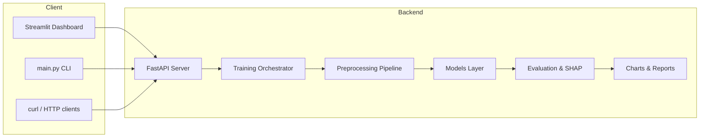

# Volatility-Aware AI Sales Forecasting System

[](https://www.python.org/downloads/)
[](https://fastapi.tiangolo.com/)
[](https://streamlit.io/)
[](LICENSE)

End-to-end **demand forecasting platform** for e-commerce and retail. Train multiple time-series models (XGBoost, ARIMA, SARIMA, Naive, and a **Hybrid** stack), compare them with industry metrics, explain predictions with **SHAP**, and serve forecasts through a **FastAPI** backend with a **Streamlit** dashboard.

Designed for inventory planning, supply-chain optimization, and explainable ML workflows — without training inside the UI (all ML runs on the API for a clean separation of concerns).

---

## Table of Contents

- [Features](#features)
- [Architecture](#architecture)
- [Tech Stack](#tech-stack)
- [Project Structure](#project-structure)
- [Prerequisites](#prerequisites)
- [Installation](#installation)
- [Configuration](#configuration)
- [Quick Start](#quick-start)
- [Usage Guide](#usage-guide)
- [Input Data Format](#input-data-format)
- [Models & Pipeline](#models--pipeline)
- [API Reference](#api-reference)
- [Outputs & Artifacts](#outputs--artifacts)
- [Testing](#testing)
- [Troubleshooting](#troubleshooting)
- [Push to GitHub](#push-to-github)
- [License](#license)

---

## Features

| Capability | Description |
|------------|-------------|
| **Multi-model training** | Naive, ARIMA, SARIMA, XGBoost, and Hybrid (XGBoost + ARIMA on residuals) |
| **Volatility-aware features** | Rolling volatility windows for unstable demand patterns |
| **SHAP explainability** | Feature importance pruning and summary plots |
| **Time-based validation** | Chronological train/val/test splits — no random shuffle leakage |
| **REST API** | Upload, train, forecast, and metrics via FastAPI |
| **Streamlit dashboard** | Upload CSV, trigger training, view charts and SHAP |
| **CLI** | `main.py` commands for API, UI, sample data, and headless training |
| **Caching** | Parquet cache for faster reloads on large datasets |
| **Reports** | HTML forecast reports and model comparison CSV |
| **Extensible registry** | Plug in new forecasters via `BaseForecaster` / `ModelRegistry` |

---

## Architecture



**Request flow**

1. User uploads a CSV (`POST /upload`) or places data in `data/raw/`.
2. User triggers training (`POST /train`) — runs preprocessing, feature engineering, model fitting, SHAP selection, and evaluation.
3. Dashboard or API reads metrics (`GET /metrics`) and product forecasts (`GET /forecast/{product_id}`).

> **Important:** Streamlit never trains models locally. It always calls the FastAPI backend.

---

## Tech Stack

| Layer | Libraries |
|-------|-----------|
| API | FastAPI, Uvicorn, Pydantic |
| UI | Streamlit, Plotly, Requests |
| ML | XGBoost, scikit-learn, statsmodels (ARIMA/SARIMA) |
| Explainability | SHAP |
| Data | Pandas, NumPy, PyArrow (Parquet) |
| Viz | Matplotlib, Seaborn |
| Testing | pytest, httpx |

---

## Project Structure

```
ai-demand-forecasting/
├── app.py                      # Streamlit dashboard
├── main.py                     # CLI: api | ui | sample-data | train
├── run.ps1                     # Windows helper: start API + UI
├── requirements.txt
├── pytest.ini
├── .env.example                # Copy to .env
├── api/
│   └── server.py               # FastAPI routes
├── config/
│   ├── settings.py             # Paths, ratios, hyperparameters
│   └── logging_config.py
├── preprocessing/
│   ├── data_loader.py
│   ├── column_names.py         # Flexible CSV header aliases
│   ├── feature_engineering.py
│   ├── preprocessing_pipeline.py
│   └── validation.py
├── models/
│   ├── train.py                # Training orchestrator
│   ├── predict.py
│   ├── baseline_models.py      # Naive, ARIMA, SARIMA
│   ├── hybrid_model.py         # XGBoost + ARIMA residuals
│   └── model_utils.py          # Registry & tuning
├── evaluation/
│   ├── metrics.py              # RMSLE, RMSE, R², etc.
│   └── comparison.py
├── visualization/
│   ├── plots.py
│   └── shap_visualizer.py
├── reporting/
│   └── reporter.py             # HTML + text reports
├── utils/
│   └── sample_data.py          # Synthetic demo CSV
├── tests/                      # 19 pytest tests
├── data/
│   ├── raw/                    # User CSVs (gitignored)
│   ├── processed/
│   └── cache/
├── saved_models/               # Joblib artifacts (gitignored)
├── outputs/
│   ├── charts/
│   ├── shap/
│   └── reports/
├── docs/screenshots/           # README images
└── ai-demand-forecasting/      # Optional legacy Jupyter notebook + Olist data
```

---

## Prerequisites

- **Python 3.10+** (tested on 3.12)
- **pip** and a virtual environment (recommended)
- **Git** (for cloning and pushing to GitHub)
- **~2 GB disk** for dependencies; training memory depends on dataset size

---

## Installation

### 1. Clone the repository

```bash
git clone https://github.com/YOUR_USERNAME/ai-demand-forecasting.git
cd ai-demand-forecasting
```

### 2. Create and activate a virtual environment

**Windows (PowerShell)**

```powershell
python -m venv venv
.\venv\Scripts\Activate.ps1
```

**macOS / Linux**

```bash
python3 -m venv venv
source venv/bin/activate
```

### 3. Install dependencies

```bash
pip install -r requirements.txt
```

### 4. Configure environment

```bash
# Windows
copy .env.example .env

# macOS / Linux
cp .env.example .env
```

Edit `.env` if you change the API host or port.

### 5. Generate sample data (optional)

```bash
python main.py sample-data
```

Creates `data/raw/sample_sales.csv` with 5 products × 120 days of synthetic sales.

---

## Configuration

| Variable | Default | Description |
|----------|---------|-------------|
| `API_HOST` | `127.0.0.1` | FastAPI bind address |
| `API_PORT` | `8000` | FastAPI port |
| `API_BASE_URL` | `http://127.0.0.1:8000` | URL Streamlit uses to call API |
| `LOG_LEVEL` | `INFO` | `DEBUG`, `INFO`, `WARNING`, `ERROR` |
| `LOG_FILE` | `forecasting.log` | Log filename under `logs/` |

Train/validation/test ratios and ML defaults live in `config/settings.py`.

---

## Quick Start

Open **two terminals** (or use `run.ps1` on Windows).

**Terminal 1 — API**

```bash
python main.py api
```

- API docs: http://127.0.0.1:8000/docs  
- Health: http://127.0.0.1:8000/health  

**Terminal 2 — Dashboard**

```bash
python main.py ui
```

- Dashboard: http://localhost:8501  

**Windows one-liner**

```powershell
.\run.ps1
```

Then in the UI: **Upload Data** → **Run Pipeline** → **Results** / **Explainability**.

---

## Usage Guide

### CLI commands

| Command | Description |
|---------|-------------|
| `python main.py api` | Start FastAPI server |
| `python main.py ui` | Start Streamlit dashboard |
| `python main.py sample-data` | Generate `data/raw/sample_sales.csv` |
| `python main.py train --file data/raw/sample_sales.csv` | Train without UI |
| `python main.py api --port 8001` | Use a different port |

### Streamlit workflow

1. **Upload Data** — Preview CSV and `POST /upload` to the API.  
2. **Run Pipeline** — `POST /train` with sidebar parameters (horizon, volatility window, SHAP threshold, ARIMA order).  
3. **Results** — Metrics table, model ranking, saved PNG charts, per-product forecast chart.  
4. **Explainability** — SHAP feature list and volatility plots.

### Headless training

```bash
python main.py sample-data
python main.py train --file data/raw/sample_sales.csv
```

Artifacts appear under `saved_models/`, `outputs/charts/`, `outputs/shap/`, and `outputs/reports/`.

---

## Input Data Format

### Required columns

| Column | Type | Description |
|--------|------|-------------|
| `date` | datetime | Transaction or order date |
| `product_id` | string | Product / SKU identifier |
| `category` | string | Product category |
| `sales_quantity` | numeric | Target — units sold |
| `price` | numeric | Unit price |
| `promotional_flag` | int (0/1) | Promotion indicator |

### Optional (auto-derived if missing)

| Column | Description |
|--------|-------------|
| `day_of_week` | 0–6 from date |
| `month` | 1–12 from date |

### Flexible headers

Headers are **case-insensitive** and mapped via aliases in `preprocessing/column_names.py`. Examples:

| Canonical | Accepted aliases |
|-----------|------------------|
| `date` | `order_date`, `sale_date`, `timestamp` |
| `product_id` | `sku`, `item_id`, `product` |
| `sales_quantity` | `qty`, `units`, `demand`, `volume` |
| `promotional_flag` | `promo`, `is_promo`, `on_promotion` |

---

## Models & Pipeline

### Baselines & ML

| Model | Role |
|-------|------|
| **Naive** | Last-value / simple baseline |
| **ARIMA** | Univariate time-series on aggregated series |
| **SARIMA** | Seasonal ARIMA |
| **XGBoost** | Gradient boosting on engineered features |
| **Hybrid** | XGBoost prediction + ARIMA on residuals |

### Hybrid model (flagship)

```
1. Train XGBoost on engineered features
2. residual = actual − xgboost_prediction
3. Train ARIMA on residuals
4. final_prediction = xgboost_prediction + arima_residual_prediction
```

### Evaluation metrics

- **RMSLE** (primary ranking metric for skewed demand)  
- **RMSE**, **MAE**, **R²**  
- Ranked comparison table and HTML report  

### Extensibility

Implement `BaseForecaster` and register in `models/model_utils.py` to add LightGBM, Prophet, LSTM, etc., without changing API contracts.

---

## API Reference

| Method | Endpoint | Description |
|--------|----------|-------------|
| `GET` | `/` | Service status |
| `GET` | `/health` | Health check |
| `POST` | `/upload` | Upload CSV (`multipart/form-data`, field `file`) |
| `POST` | `/train` | Train all models (JSON body, see below) |
| `GET` | `/forecast/{product_id}` | Forecast for product (`model_name`, `horizon` query params) |
| `GET` | `/metrics` | Last training metrics and comparison |

### Train request body

```json
{
  "forecast_horizon": 14,
  "volatility_window": 7,
  "shap_threshold": 0.01,
  "arima_order": [1, 1, 1]
}
```

### Example: upload and train

```bash
curl -X POST "http://127.0.0.1:8000/upload" \
  -F "file=@data/raw/sample_sales.csv"

curl -X POST "http://127.0.0.1:8000/train" \
  -H "Content-Type: application/json" \
  -d "{\"forecast_horizon\": 14, \"volatility_window\": 7, \"shap_threshold\": 0.01, \"arima_order\": [1, 1, 1]}"

curl "http://127.0.0.1:8000/metrics"

curl "http://127.0.0.1:8000/forecast/P001?model_name=hybrid&horizon=14"
```

Interactive docs: **http://127.0.0.1:8000/docs**

---

## Outputs & Artifacts

| Path | Content |
|------|---------|
| `saved_models/` | Joblib model bundles |
| `outputs/charts/` | Actual vs predicted, residuals, volatility, trends |
| `outputs/shap/` | SHAP summary and top-15 feature plots |
| `outputs/reports/` | `forecast_report_*.html`, `model_comparison.csv`, `summary.txt` |
| `data/processed/` | Cleaned Parquet after preprocessing |
| `data/cache/` | Cached Parquet for faster reloads |
| `logs/forecasting.log` | Application logs |

Generated paths are **gitignored** — reproduce with `sample-data` + `train` or the UI pipe


---

## Testing

```bash
pytest -v
```

Covers preprocessing, models, API endpoints, and column normalization. Expect ~1–2 minutes on first run (ARIMA/SARIMA fitting).

---

## Troubleshooting

| Issue | Fix |
|-------|-----|
| **Cannot connect to API** in Streamlit | Start `python main.py api` first; confirm `API_BASE_URL` in `.env` |
| **Port 8000 already in use** | Stop the other process or `python main.py api --port 8001` and update `.env` |
| **No dataset uploaded** | Run `sample-data`, upload in UI, or `POST /upload` |
| **Models not trained** | Call `POST /train` before `/forecast` or `/metrics` |
| **SHAP plots missing** | Complete training; check `outputs/shap/` |
| **Slow training** | Reduce products in CSV or use smaller date range; cache helps on re-runs |

---

## Push to GitHub

The repo is configured to **exclude** secrets (`.env`), large CSVs, caches, trained models, and generated outputs. Follow these steps:

### 1. Initialize Git (if not already)

```powershell
cd c:\Users\saksh\Downloads\ai-demand-forecasting
git init
```

### 2. Review what will be committed

```bash
git status
```

You should see source code, `README.md`, `requirements.txt`, `.gitignore`, `.env.example`, `LICENSE`, `docs/screenshots/`, and `data/raw/.gitkeep` — **not** `.env`, `data/raw/*.csv`, `saved_models/`, or `outputs/`.

### 3. Stage and commit

```bash
git add .
git commit -m "Initial commit: volatility-aware AI demand forecasting platform"
```

### 4. Create a GitHub repository

1. Go to https://github.com/new  
2. Name it `ai-demand-forecasting` (or your choice)  
3. Do **not** add a README if you already have one locally  

### 5. Push

```bash
git branch -M main
git remote add origin https://github.com/YOUR_USERNAME/ai-demand-forecasting.git
git push -u origin main
```

Replace `YOUR_USERNAME` with your GitHub username.

### What is not pushed (by design)

- `.env` — copy from `.env.example` after clone  
- `data/raw/*.csv` — use `python main.py sample-data` or upload via API  
- `ai-demand-forecasting/data/*.csv` — large Olist datasets in the legacy notebook folder  
- `saved_models/`, `outputs/`, `logs/`, `data/cache/` — regenerated locally  

---

## Optional: Legacy Jupyter notebook

The folder `ai-demand-forecasting/` contains an exploratory notebook (`ai_demand_forecasting.ipynb`) and optional **Olist Brazilian E-commerce** CSVs. Those CSV files are **not** tracked in Git due to size. Download from [Kaggle Olist dataset](https://www.kaggle.com/datasets/olistbr/brazilian-ecommerce) if you want to run the notebook locally.

---

## Performance notes

- Vectorized Pandas/NumPy operations in preprocessing hot paths  
- Parquet caching in `data/cache/` for datasets up to millions of rows  
- Time-based splits only — no random shuffling on time series  

---

## License

This project is licensed under the [MIT License](LICENSE). Free for learning, portfolios, and production pilots.

---

## Author & contributions

Contributions are welcome via issues and pull requests. For bugs, include your Python version, command run, and relevant log lines from `logs/forecasting.log`.
